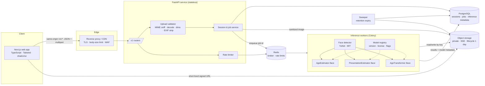
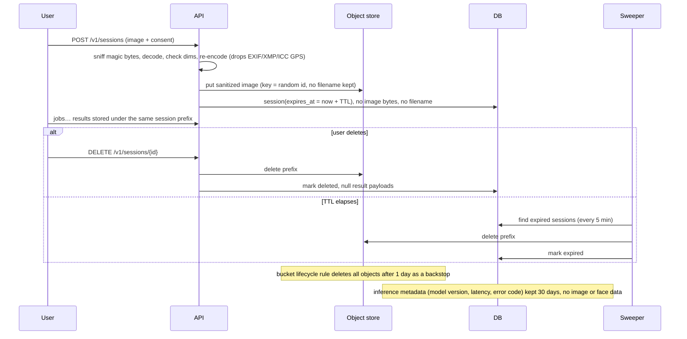

# FaceLens — Product & Technical Plan

> Working name. Status: Phase 0 (plan) + Phase 1 (API foundation) implemented. Dated 2026-09-24.

## 1. Product brief

FaceLens is a privacy-first web app offering three **opt-in, illustrative** face-image tools:

| Tool | What it returns | What it is NOT |
|---|---|---|
| Estimate age | Approximate age range with an uncertainty band | Verified age, eligibility, identity |
| Estimate perceived presentation | How a model *perceives* gender presentation in this photo, with confidence and an "uncertain" outcome | A person's gender identity, sex, or any fact about them |
| Preview age transformation | A synthetic image toward a chosen target age group | A prediction of how someone will/did look |

**Audience:** adults curious about the tools, for personal use on their own photos (or photos they have permission to use).

**Explicit non-uses** (stated in UI, docs, API terms): hiring, policing, access control/age-gating, healthcare, insurance, credit, education admissions, surveillance, identification, or any consequential decision.

### Assumptions (change any of these and tell me)

1. **Commercial deployment intent** ("industry-ready"), so every model and dataset must have a license that allows commercial use. This rules out most academic face-attribute models (see §7).
2. **No accounts.** Anonymous sessions only; no identity data collected.
3. **Adults only.** Users attest they and the pictured person are 18+. If the age estimator's *upper* bound falls below 18, the result is withheld (see §7.4). Minors' images are not supported.
4. **Retention:** uploads and results auto-delete after **1 hour** (configurable, max 24 h); users can delete immediately. Only non-image inference metadata is kept for 30 days.
5. **Local dev** runs on CPU with no Docker available on this machine, so the API also runs natively (SQLite + in-process jobs). Docker Compose (Postgres + Redis + worker) is the reference environment.
6. **Python 3.12** is the target (Docker, CI). Code stays 3.11-compatible because this machine has 3.11.6. This is the only stack deviation.
7. No real model ships enabled until it passes the license gate and the evaluation in §7. Until then, each feature runs on a **clearly labeled mock provider** (flagged `is_mock: true` in the API and shown as a banner in the UI), or the feature is disabled.

## 2. User journeys & pages

**J1 Estimate age:** Landing → choose tool → read limitations → consent (permission + adult + purpose) → upload/drag-drop → preview/crop → submit → processing (status, cancel) → result (range + uncertainty + limitations) → delete / try another.

**J2 Perceived presentation:** same flow. The result shows a spectrum (more feminine-presenting ↔ more masculine-presenting) with confidence, or "Uncertain" when confidence is low. Wording never says "you are".

**J3 Age transformation:** consent → upload → choose target group (young adult · middle-aged adult · older adult; child/teen shown **disabled with an explanation** unless the model supports them and policy allows) → generate → processing shows the target → before/after slider → change target and regenerate (the image stays in the session, so no re-upload) → download (watermarked "Synthetic — illustrative") → delete.

**J4 Delete:** "Delete now" is on every result, and `DELETE /v1/sessions/{id}` wipes the upload, derivatives, and results. Confirmation shows what was removed.

### Pages / components

- `/` Landing: three tool cards, "how it works", limitations, privacy summary, acceptable-use section
- `/tools/age`, `/tools/presentation`, `/tools/aging`: one shared `ToolFlow` shell
- `/privacy`, `/responsible-use`, `/model-cards` (generated from the model registry)
- Components: `ConsentPanel`, `UploadDropzone`, `ImageCropper`, `PrivacyNote` (inline), `TargetAgeSelector`, `JobStatus` (progress + cancel), `AgeResultCard`, `PresentationResultCard`, `BeforeAfterSlider`, `MockBanner`, `ErrorState` (variants: validation, no-face, multi-face, model-error, rate-limit, timeout, network), `DeleteButton`, `RetentionCountdown`

## 3. Design system

**Tone:** calm, clinical-but-warm, explanatory. No scanning lines, no bounding-box overlays on faces, no "detected!" language.

- **Color** (tokens as CSS variables, light/dark):
  - `--bg` #FAFAF7 / #111315; `--surface` #FFFFFF / #1A1D20; `--text` #1C1F23 / #ECEDEE; `--muted` #5B636B / #A3ABB3 (≥4.5:1 on bg)
  - `--primary` deep teal #0F6E6E / #5CC8C0 (≥4.5:1 text contrast); `--accent` soft sand #E9DCC6
  - `--info` #2B5FA8, `--warning` #8A5A00, `--danger` #B42318, `--success` #1E7B4F; each has an `-subtle` background
  - Uncertainty visual: a gradient band in `--primary` at 20–60% opacity. No red/green "right/wrong" encodings.
- **Typography:** Inter (UI) + Source Serif 4 (headings on landing only); scale 12/14/16/18/20/24/30/36/48; body 16px, line-height 1.6; max line length 70ch.
- **Spacing:** 4px base (4, 8, 12, 16, 24, 32, 48, 64, 96); radius 8/12/16; one soft shadow level.
- **Components:** shadcn/ui (Radix primitives → accessible by default): Button, Card, Dialog, Checkbox, RadioGroup (target age), Slider (before/after), Progress, Alert, Toast, Tooltip, Tabs.
- **Motion:** 150–250 ms ease-out; everything respects `prefers-reduced-motion` (the slider and progress show no animation).
- **A11y target:** WCAG 2.2 AA: 24×24 min targets, visible focus rings, `aria-live="polite"` job status, labelled dropzone with a keyboard file-picker fallback, error text linked via `aria-describedby`, crop controls operable with arrow keys.

## 4. Architecture



Routing: the browser calls the API **on the same origin at `/v1/*`**. In production the load balancer routes `/v1/*` straight to the API (so rate limits see real client IPs and uploads bypass Node) and everything else to Next.js. In development, a Next rewrite does the same. Responsibilities: the **web** app handles presentation only. The **API** handles validation, sessions, and orchestration, and does no ML. **Workers** do all inference behind `Protocol` interfaces. **Storage** sits behind a `BlobStore` interface (local FS ↔ S3-compatible). In local demo mode the API runs jobs in-process through the same interface (`JOB_BACKEND=inline`).

## 5. Repository structure

```
.
├── apps/
│   ├── api/                  # FastAPI service + workers (one Python package)
│   │   ├── src/facelens_api/
│   │   │   ├── main.py       # app factory, lifespan, middleware
│   │   │   ├── config.py     # pydantic-settings, validated at startup
│   │   │   ├── logging.py    # structlog JSON, request-id, redaction
│   │   │   ├── api/v1/       # routers: health, sessions, jobs, models
│   │   │   ├── schemas/      # Pydantic request/response models
│   │   │   ├── domain/       # errors, enums (target age groups, job states)
│   │   │   ├── imaging/      # validation, sanitization (EXIF strip)
│   │   │   ├── storage/      # BlobStore: local, s3
│   │   │   ├── db/           # SQLAlchemy models, engine, migrations/ (Alembic, shipped in wheel)
│   │   │   ├── jobs/         # runners: sync, thread, celery (+ worker entrypoint)
│   │   │   ├── ml/           # face detection + alignment, pinned artifacts, providers, registry, mocks
│   │   │   └── services/     # session/job orchestration, retention sweeper
│   │   ├── tests/
│   │   ├── pyproject.toml
│   │   └── Dockerfile
│   └── web/                  # Next.js app (Phase 3)
├── eval/                     # fairness/accuracy evaluation harness (Phase 4)
├── docs/                     # PLAN, RUNBOOK, MODEL_CARDS
├── docker-compose.yml
├── .env.example
└── .github/workflows/ci.yml
```

## 6. API contract (v1)

The source of truth is the OpenAPI schema at `/openapi.json` (not served in production); the examples below match the code as of Phase 2. All responses carry `X-Request-ID`. Errors use one shape:
```json
{ "error": { "code": "no_face_detected", "message": "We couldn't find a face…", "retryable": false, "request_id": "…", "details": {…} } }
```
Error codes: `invalid_file_type`, `file_too_large`, `image_too_small`, `image_too_large`, `corrupt_image`, `consent_required`, `no_face_detected`, `multiple_faces_detected`, `face_too_small`, `unsupported_target_age_group`, `feature_disabled`, `rate_limited` (+`Retry-After`), `session_not_found` (also returned for expired or unauthorized sessions), `job_not_found`, `result_not_found`, `job_not_cancellable`, `adults_only`, `model_error`, `inference_timeout`, `validation_error`, `internal_error`.

**Create a session (upload)** `POST /v1/sessions`, multipart with `image` and `consent` (JSON: `{"has_permission":true,"is_adult":true,"accepts_limitations":true}`)
```json
201 { "session_id": "s_…", "session_token": "…(returned once)…", "expires_at": "2026-09-24T18:00:00Z",
      "image": { "width": 1024, "height": 1024, "format": "jpeg", "metadata_stripped": true,
                 "url": "/v1/sessions/s_…/image?exp=…&sig=…", "url_expires_at": "…" },
      "face_check": { "status": "single_face" } }
```
The session-scoped calls below need the header `X-Session-Token`. Image links (`url`, `image_url`) are HMAC-signed and valid for 5 minutes, so plain `` tags work.

**Start a job** `POST /v1/sessions/{id}/jobs`
```json
{ "task": "age_estimation" }
{ "task": "presentation_estimation" }
{ "task": "age_transformation", "params": { "target_age_group": "older_adult" } }
→ 202 JobView (status "queued"/"running", or already terminal with the sync runner)
```
**Poll** `GET /v1/jobs/{job_id}` returns a JobView: `status` (`queued | running | succeeded | failed | cancelled`), `progress` (0–1), `stage` (`preparing | detecting_face | estimating | rendering`), `result` or `error`, and `model {id, version, is_mock}`.
**Cancel** `DELETE /v1/jobs/{job_id}` is best-effort. A running model call finishes, but its output is discarded.

Result payloads (`status: succeeded`):
```json
{ "task": "age_estimation", "result": {
    "estimate_years": 34, "range_years": [28, 40], "interval_coverage": 0.8,
    "disclaimer_code": "age_estimate_v1" },
  "model": { "id": "mock-age-estimator", "version": "0.1.0", "is_mock": true } }

{ "task": "presentation_estimation", "result": {
    "outcome": "uncertain",            // "feminine_presenting" | "masculine_presenting" | "uncertain"
    "scores": { "feminine_presenting": 0.52, "masculine_presenting": 0.48 },
    "uncertain_threshold": 0.75, "disclaimer_code": "presentation_estimate_v1" } }

{ "task": "age_transformation", "result": {
    "target_age_group": "older_adult",
    "image_url": "/v1/results/j_…/image?exp=…&sig=…", "image_url_expires_at": "…",
    "synthetic": true, "watermarked": true, "disclaimer_code": "synthetic_image_v1" } }
```
**Capabilities** `GET /v1/models` returns `face_detection` (model, license, min face size, policy), `features[]` (enabled, model card with `is_mock`), `target_age_groups[]` (with `available` and a `reason`), upload limits, `session_ttl_seconds`, and `consent_version`.
**Delete** `DELETE /v1/sessions/{id}` returns `204` and removes the upload, generated images, and result payloads. It works even after the TTL, before the sweeper runs.
**Ops** `GET /healthz` (liveness), `GET /readyz` (DB, storage, Redis if configured, sweeper freshness).

### Data-retention flow



The original upload bytes are never persisted: only the re-encoded, metadata-free image is. Filenames are discarded.

## 7. Models: selection, licensing, evaluation, fairness

### 7.1 License review (desk review on 2026-09-24; **legal must confirm before production**)

| Candidate | Role | Code / weights license | Training data | Verdict |
|---|---|---|---|---|
| **OpenCV Zoo YuNet** | Face detection + 5 landmarks | MIT (per model dir) | WIDER FACE (research-oriented; review) | **Selected** for detection/alignment; small ONNX, CPU-friendly via `opencv-python-headless` (Apache-2.0) |
| MediaPipe BlazeFace | Face detection | Apache-2.0 | Google internal | Fallback option |
| InsightFace (buffalo, genderage) | Detection, age, gender | Code MIT, **pretrained models non-commercial** | MS1M/Glint etc. | **Rejected** for commercial use |
| **MiVOLO v2** (`iitolstykh/mivolo_v2`) | Age (+ binary gender head) | HF tag Apache-2.0; repo also ships a separate `license/` folder | Lagenda (collected by authors; provenance/consent unclear) | **Candidate, needs legal review** of the repo license folder and Lagenda provenance |
| FairFace ResNet-34 | Age bins, gender, race | CC BY 4.0 (dataset) | FairFace (balanced across 7 race groups) | Useful as a **held-out evaluation set**. Serving it is not preferred because the model has a race head we must not expose. |
| DEX / IMDB-WIKI, UTKFace models | Age/gender | Datasets **research-only / non-commercial** | — | **Rejected** |
| SAM (Alaluf et al.) | Age transformation | Code MIT; pretrained on FFHQ/FFHQ-Aging, which is **CC BY-NC-SA 4.0 (non-commercial)** | FFHQ | **Rejected for commercial**; OK only for a non-commercial research deployment |
| FADING / diffusion age editing | Age transformation | Depends on base SD model (OpenRAIL-M) + fine-tune data | FFHQ-Aging | Same data problem, **rejected for commercial** until clean data exists |
| Commercial API (licensed vendor) | Age transformation | Contract | Vendor | **Recommended production path** for aging, behind `AgeTransformer` |

**Consequence:** no age-transformation model that is freely licensed for commercial use is known to be available. The aging feature ships with a **mock provider** (deterministic, labeled "MOCK: not a real transformation", which just overlays a label on a tinted copy) and a documented integration point (`ml/providers/age_transformer.py`). The same applies to presentation estimation if the MiVOLO review fails.

"Gender" heads in available models are trained on **binary labels**. We map them to *perceived presentation*, add an explicit "uncertain" band (below a calibrated confidence threshold), and never output a binary claim about identity. This is a known limitation and is documented in the model card.

### 7.2 Model registry

Each provider declares `ModelInfo(id, version, task, license, source_url, sha256, is_mock, supported_target_age_groups, intended_use, limitations)`. At startup the service **refuses to enable** a non-mock provider whose `license_approved` flag is false or whose checksum mismatches. `GET /v1/models` exposes the cards.

### 7.3 Evaluation plan (`eval/`, Phase 4)

- **Data:** FairFace validation split (CC BY 4.0) for age bins + perceived-gender labels across 7 annotated race groups. Skin tone is scored with the **Monk Skin Tone scale (MST, CC BY 4.0)** using a documented annotation protocol on a consented sample. Presentation style is scored on a consented internal set (glasses, head coverings, facial hair, makeup, hair length), which requires recruiting with consent. Exclude all images of minors from reporting.
- **Metrics:** age MAE, coverage of the reported range (target 80%), and calibration (ECE); presentation: accuracy vs. annotator-perceived labels, **abstention rate**, and selective accuracy at the uncertainty threshold; detection: miss rate. Every metric is reported **per subgroup with 95% bootstrap CIs**, plus the worst-group gap.
- **Release gates (pre-registered 2026-09-25, before any evaluation run).** Group families: annotated race (7), annotated perceived gender (2), and adult age bin (20–29 … 70+). A gate fails if **any** family violates it. The comparison uses point estimates, and 95% bootstrap CIs are reported alongside.
  - *Face detection:* **miss-rate** (`no_face_detected`) gap between best and worst group ≤ 3 pp. Multiple-face and too-small rejections are correct policy behaviour. They are reported per group but not gated, because they reflect photo composition rather than detector failure. (Wording clarified 2026-09-25 after a 64-image smoke run, before the full evaluation.)
  - *Age* (adults, bins 20+, calibrated interval with 80% target): worst-group MAE-to-bin ≤ 1.5× overall; worst-group interval coverage ≥ 70%; false *adults-only* block rate ≤ 1% in every group.
  - *Presentation* (fixed threshold 0.75, not tuned): selective accuracy vs. the annotated perceived gender, gap ≤ 5 pp between groups; worst-group abstention ≤ 2× overall.
  - Definitions for bin labels. *MAE-to-bin* is the distance from the prediction to the annotated bin (0 inside it). *Coverage* means the interval overlaps the bin. The calibration split (40%, stratified by race × age) sets the conformal half-width; every reported number comes from the disjoint 60% test split.
  - A failed gate means the model is refused at startup (`ModelPolicyError`). Only the dev-only `FACELENS_ALLOW_UNGATED_MODELS` overrides it, and it is refused in staging and production.
- **Aging gates (pre-registered 2026-09-25, before any aging evaluation run).** The sample is 20 test-split adult FairFace images per annotated race group whose faces pass the detection policy. Each image is transformed to *young adult* (25) and *older adult* (70).
  - *Target attainment:* the output's estimated age (MiVOLO, production path), per race group. Older adult: mean ≥ 55. Young adult: mean within 18–40. For each target, the gap between race groups in mean attained age is ≤ 10 years.
  - *Skin-tone preservation:* the mean CIELAB colour of two cheek patches in the aligned face, input vs. output. Per group: mean ΔE76 ≤ 8 and mean |ΔL*| ≤ 5. Across groups, the gap in mean signed ΔL* is ≤ 3, which catches systematic lightening or darkening of particular groups (a known FFHQ bias).
  - *Integrity:* the output still passes the one-face policy for ≥ 95% of images in every group.
  - Identity preservation is **not** measured. That would need a face-recognition model, which the product deliberately excludes. It is left to a future consented human-rating study.
- **Reporting:** results go into `docs/MODEL_CARDS.md` with dataset versions and the date. The UI quotes **only measured numbers**; there is no "99% accurate" copy.

### 7.4 Minor-safety guard

The consent step includes an adult attestation, which is the primary control. As a second layer, when a **real** age estimator is registered, every tool (age, presentation, aging) fails with `adults_only` if the estimate's *upper* bound is under 18. The upper bound is used so that uncertainty never excludes adults. A mock estimator can't judge age, so the guard is inactive with mocks. This is implemented and tested (`tests/test_safety.py`). The child and teen *target* groups are disabled by default (`AGING_ALLOW_YOUNG_TARGETS=false`). Enabling them requires the legal review named in the brief.

## 8. Threat model & deployment

| Threat | Mitigation |
|---|---|
| Malicious files (polyglots, decompression bombs, SVG/XSS) | Magic-byte sniff, allowlist JPEG/PNG/WebP, Pillow `MAX_IMAGE_PIXELS`, decode + re-encode, max 10 MB / 4096², no SVG, served with `Content-Disposition` + `nosniff` |
| Metadata leaks (GPS in EXIF) | Re-encode from pixels only; filename discarded |
| Image or inference leakage via logs | structlog redaction processor; logs never contain bytes, filenames, or result values, only IDs, codes, and latency |
| Unauthorized access to others' results | Unguessable 128-bit IDs + a per-session secret token (returned once, sent as a header); signed, short-lived (5 min) result URLs |
| Abuse / scraping / DoS | Per-IP + per-session rate limits (Redis), body-size limit at proxy, job timeouts, queue depth cap, CAPTCHA optional |
| Surveillance misuse (bulk processing) | No batch endpoint, no multi-face processing, no face comparison, rate limits, ToS |
| Deepfake misuse of aging output | Visible "SYNTHETIC IMAGE" band plus a JPEG comment marker, applied by the pipeline rather than the provider (done). C2PA credentials in Phase 5. Adults only, no minor targets. |
| Model supply-chain | Pinned checksums in the registry, weights from verified sources, license gate |
| Secrets | Env vars / secrets manager; `.env` git-ignored; config validation fails fast |
| Data retention failure | Sweeper + bucket lifecycle backstop + readiness check that the sweeper ran recently |

**Deployment (documented option):** containers on a managed platform (e.g. AWS ECS Fargate or Cloud Run). The API and workers are separate services; RDS Postgres, ElastiCache Redis, and a private S3 bucket (SSE-KMS, block public access, 1-day lifecycle rule). The web app runs on Vercel or a container. TLS at the load balancer. The GPU worker pool is only needed if a real aging model is added.

## 9. Phased checklist

| Phase | Scope | Acceptance criteria |
|---|---|---|
| **0 Plan** ✅ | This document | Reviewed by owner |
| **1 API foundation** ✅ | FastAPI app factory, config validation, structured logs + request IDs + redaction, error model, health/ready, upload validation + EXIF strip, BlobStore (local), SQLAlchemy models + Alembic, sessions (create/delete/expire), consent enforcement, rate limit (memory), mock providers labeled `is_mock`, inline jobs, sweeper, tests | `pytest`, `ruff`, `mypy --strict` pass; invalid uploads, deletion, expiry, consent, contract tests green |
| **2 Face pipeline & backends** ✅ | YuNet detection (no-face / multi-face / too-small) at upload *and* before inference, iterative eye alignment, pinned SHA-256 model artifacts + `fetch-models`, detector in `GET /v1/models` and job metadata, Celery runner + worker, Redis rate limiter, S3 BlobStore, Docker image with baked models, Compose (Postgres/Redis/MinIO/API/worker), runbook, model cards | Face-policy tests on a public-domain fixture; S3 (moto), Redis (fakeredis), Celery (eager) tests; Postgres test in CI; unapproved real model refused (test) |
| **3 Web app** ✅ | Next.js 16 + Tailwind v4 + shadcn/ui: landing, three tool flows, consent gating, drag-and-drop/picker, on-device re-encode + framing (crop), target selector with unavailable reasons, job status + cancel, results (range-first age, presentation spectrum, before/after + download + regenerate without re-upload), all error states, mock banner, inline privacy + retention countdown, delete dialog; nonce CSP; API types generated from OpenAPI | Vitest 37 tests (client, polling, errors, crop math, components, flow vs fake API); Playwright 13 tests vs real API on desktop + mobile: **0 axe WCAG 2.2 AA violations, 0 CSP violations** across landing, policy pages, every flow state, errors, dialog. (Lighthouse not run.) |
| 4 Models & evaluation | License review sign-off; integrate approved age/presentation models; eval harness; model cards with measured, subgroup-sliced results | Release gates in §7.3 met or feature stays mock/disabled |
| 5 Production hardening | Docker images, Compose, CI (lint, type, test, build, Playwright), watermark/C2PA on synthetic output, runbook, deployment IaC notes, load test | `docker compose up` green; CI green; runbook covers deploy, rollback, deletion requests, incident |
